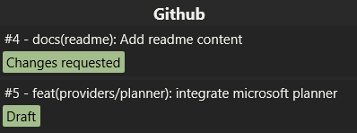
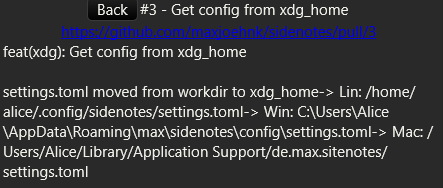

# Sidenotes

A small desktop app to view github PRs, gitlab MRs, jira issues, taskwarrior tasks, joplin notebooks and upsource tasks in a sidebar.

Overview-Page:



Detail-Page:



## Features

All features are optional but will be installed by default.

Available:

* github
* gitlab
* jira
* taskwarrior
* joplin
* upsource
* confluence

## Installation

Create a `settings.toml` in `$XDG_HOME/sitenotes/`

Example:

```toml
sync_timeout = 30

[[provider]]
name = "Github"
type = "github"
token = "<github token>"
repos = ["maxjoehnk/sidenotes"]

[[provider]]
name = "Gitlab"
type = "gitlab"
url = "your.gitlab.url"
token = "<gitlab token>"
repos = ["maxjoehnk/sidenotes"]

[[provider]]
name = "Jira"
type = "Jira"
url = "https://your.jira.url"
username = "your-username"
password = "your-password"
jql = "assignee = currentUser() and statusCategory != Done"

[[provider]]
name = "Tasks"
type = "taskwarrior"
query = "status:pending"

[[provider]]
type = "joplin"
token = "<Web Clipper token>"
show_notebook_names = false # Show the notebook title as a tag below the todo
# Notebook Ids
notebooks = ["bc956e0e43b74c678817a1e82f468127", "d705bc49caa34927926a3c8018bf593d", "cc1fe66cbf384c60b65978dec330f364", "5002ad0da82f4e6e8b3c3735ae205c41", "8a537e1c29e14884a32efd28c629652c"]

[[provider]]
type = "upsource"
url = "https://your-upsource-instance"
token = "auth token"
# optional, default is "state: open"
query = "an upsource query"

[[provider]]
type = "confluence"
username = "your-usernamee"
password = "your-password"
url = "https://your.confluence.url"
```
