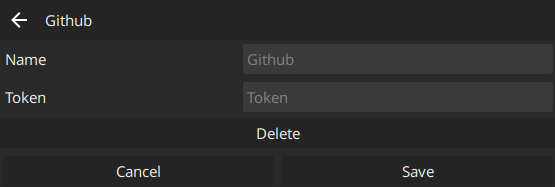
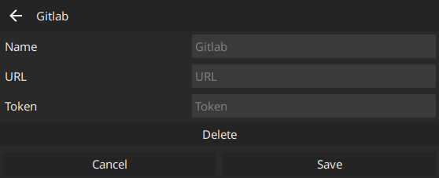
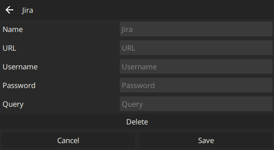
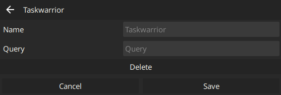
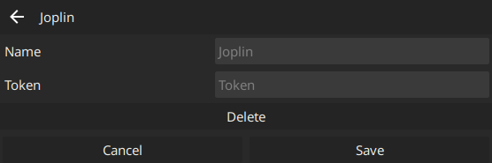
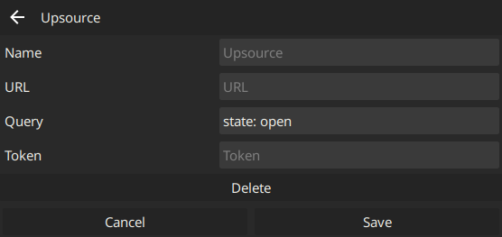
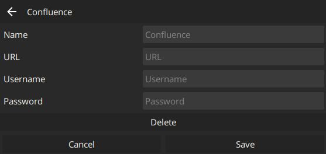
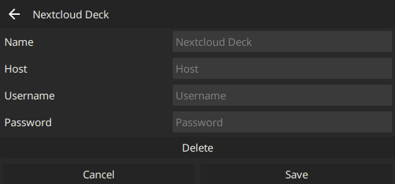

A small desktop app to view github PRs, gitlab MRs, jira issues, taskwarrior tasks, joplin notebooks and upsource tasks in a sidebar.

### Supported Providers

* [Github](#github)
* [Gitlab](#gitlab)
* [Jira](#jira)
* [Taskwarrior](#taskwarrior)
* [Joplin](#joplin)
* [Upsource](#upsource)
* [Confluence](#confluence)
* [Nextcloud Deck](#nextcloud-deck)

#### Github

The Github provider supports a list of open pull requests as well as a running a search for issues and prs.



##### Config

```toml
[[provider]]
type = "github" # required
token = "<github token>" # required
repos = ["maxjoehnk/sidenotes"] # optional
query = "type:pr is:open draft:false author:@me review:changes_requested" # optional
```

At least one of `repos` or `query` is required for the Github provider to show anything.

#### Gitlab

The Gitlab provider supports a list of open pull requests.



##### Config

```toml
[[provider]]
type = "gitlab" # required
url = "your.gitlab.url" # required
token = "<gitlab token>" # required
repos = ["maxjoehnk/sidenotes"] # required
show_drafts = true # optional (default: false)
```

#### Jira

The Jira provider supports any valid JQL query.



##### Config

```toml
[[provider]]
type = "jira" # required
url = "https://your.jira.url" # required
username = "your username" # required
password = "your password" # required
jql = "assignee = currentUser() and statusCategory != Done" # required
```

#### Taskwarrior

The Taskwarrior provider supports [Filters](https://taskwarrior.org/docs/filter.html).



##### Config

```toml
[[provider]]
type = "taskwarrior" # required
query = "status:pending" # required
```

#### Joplin

The Joplin provider shows a list of todos in all configured notebooks.



##### Config

```toml
[[provider]]
type = "joplin" # required
token = "web clipper token" # required
show_notebook_names = false # optional (default: false)
# Notebook Ids
notebooks = ["bc956e0e43b74c678817a1e82f468127"] # required
```

#### Upsource

The Upsource provider shows reviews matching the configured `query`.



##### Config

```toml
[[provider]]
type = "upsource" # required
url = "https://your-upsource-instance" # required
token = "auth token" # required
query = "state: open" # optional (default: "state: open")
```

#### Confluence

The Confluence provider shows assigned tasks from Inline Tasks for self hosted Confluence.
Confluence Cloud is not supported as of now.



##### Config

```toml
[[provider]]
type = "confluence" # required
url = "https://your.confluence.url" # required
username = "your username" # required
password = "your password" # required
```

#### Nextcloud Deck

The Nextcloud Deck provider supports any valid JQL query.



##### Config

```toml
[[provider]]
type = "nextcloudDeck" # required
host = "https://nextcloud.url" # required
username = "username" # required
password = "password" # required
[[provider.boards]] # multiple supported
title = "Infrastruktur" # limit todos to cards in this board
stacks = ["TODO", "in Bearbeitung"] # limit todos to cards in these stacks
```
